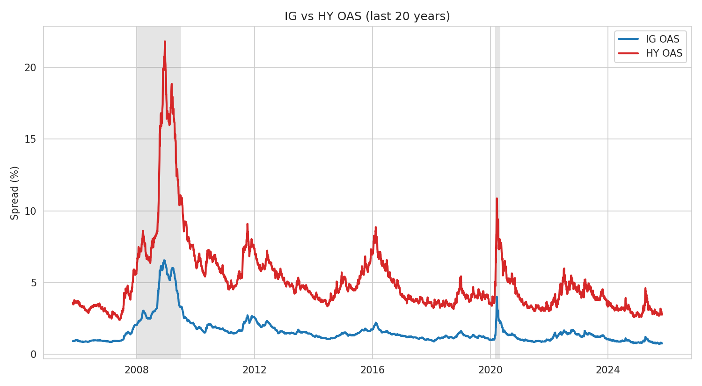
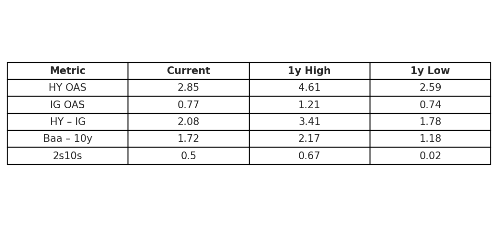
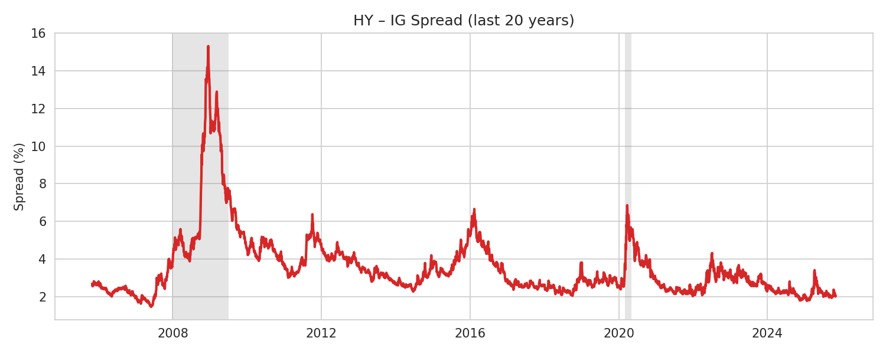
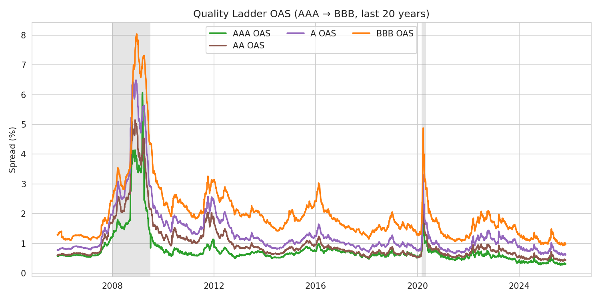

# Corporate Bond Spread Dashboard

Tracks and visualizes U.S. corporate bond spreads over time, comparing Investment Grade (IG) and High Yield (HY) OAS, and contextualizing against Treasury benchmarks. It also displays recessions which are represented by the grey portions. Outputs charts and a current spreads table and is designed to auto-update daily via GitHub Actions.

Last updated: 2025-12-23

## Key Charts








## Data Sources (FRED CSV)
- IG OAS: `BAMLC0A0CM`
- HY OAS: `BAMLH0A0HYM2`
- Moody's Baa Yield: `BAA`
- Treasury yields: `DGS10`, `DGS2`, `DGS5`
- Optional: U.S. Recession Indicator: `USREC`

All data are downloaded via FRED CSV endpoints and cached in `data/raw/`.

## Repo Structure
- `fetch_fred.py`: Download latest CSVs for series and cache with timestamp
- `compute_series.py`: Merge raw series, compute spreads and optional z-scores
- `charts.py`: Produce time-series chart and a current spreads table
- `run_pipeline.py`: Orchestrate fetch → process → visualize → README update
- `update_readme.py`: Stamp README with current UTC date
- `data/raw/`: Cached raw CSVs organized by series
- `data/processed/`: Merged daily panel (`series.csv`, `series.parquet`)
- `reports/figures/`: Charts and tables (`*.png`, `current_spreads.csv`)

## Setup
1. Python 3.10+
2. Install dependencies:
   ```bash
   pip install -r requirements.txt
   ```

## Run Locally
Run end-to-end:
```bash
python run_pipeline.py
```

Or step-by-step:
```bash
python fetch_fred.py            # downloads CSVs to data/raw/
python compute_series.py        # builds data/processed/series.csv
python charts.py                # saves charts in reports/figures/
python update_readme.py         # updates the README stamp
```

Interactive app (Streamlit):
```bash
pip install -r requirements.txt  # includes streamlit
streamlit run streamlit_app.py
```
The app reads `data/processed/series.csv`. Use the "Update Data" button to fetch from FRED and recompute if needed.

## Outputs
- Time series: IG vs HY OAS (last 5y), with optional recession shading
- Table: current HY OAS, IG OAS, HY–IG, Baa–10y, 2s10s, with 1y high/low
- Optional OAS buckets: AAA/AA/A/BBB selectable in the Streamlit app
 - New: Quality ladder chart (AAA→BBB), and a Units toggle (Percent or bps) in the app

## Automation (GitHub Actions)
Nightly cron runs the full pipeline and commits updated charts and README.
See `.github/workflows/update.yml`.

## Notes
- FRED CSV endpoints do not require an API key.
- Missing values are forward-filled to build a daily panel.
- 90-day z-scores are added for select metrics (`*_Z90`).
- Recession shading uses `USREC` if available.
